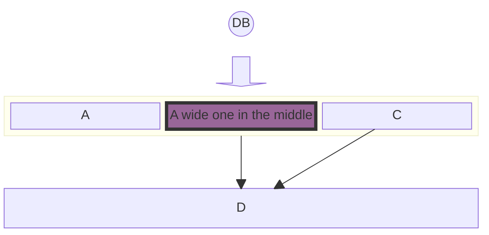
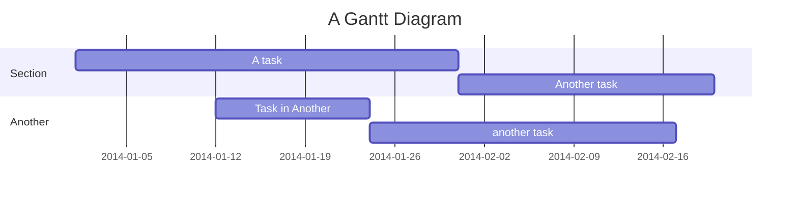

# awf-org

> AWebFactory Organization Project Flow & Tracker #BuildInPublic #LearnInPublic open projects platform based on Astro SSR
>
> As `Project Flow and Tracker` the site will soon be self-documenting.
> Meanwhile, see below [The Making of](#awebfactoryorg-project-flow--tracker-the-making-of)

- [ ] Site now self-documenting

- commit

## AWebFactory.org (Project Flow & Tracker). The Making of

- Each project contains the following items
  - any item may
    - include asset attachments)
    - be ommitted
- Attributes
  - `Name`
  - `Short Name`
  - `Description`
  - `Start date`
  - `Finish date` (no deadlines, we do WIP)
- `Legacy inputs`
- Assumptions and `Hypotheses`
- `Business Model Canvas` (BMC)
- `Lean UX Canvas`
- Initial Team meeting and `Kick-off` conversation
  - `Feature List`
  - `Design System`
  - `Initial Gantt Chart`
- `Gantt Chart` (more for registering initial and iteration planning, together with project history, not for deadlines)
- `Conversations` (project blog, one for each iteration and task)
  - `Kanban Board` (at conversation state, time vaulted (kanban on left/top, conversation on right, bottom))
- `Value Delivery Confirmation` / Improve, Maintain or Pivot decision
- `Post Mortem`
- There may be occasional `Blog Posts` related to the project items

### Project Attributes

- Name: AWebFactory.org (Project Flow & Tracker)
- Short Name: awf-org
- Description:
- Start date: 2024-02-09
- Finish date (no deadlines, we do WIP)

### Business Model Canvas



### Lean Ux Canvas

block diagram

### Feature List

table

### Gantt Chart



### Design System

### Kanban Board

### Conversations

### Confirmation

- [Repo](https://github.com/awebfactory/awf-org)
- Staging site
- Production site

### Scaffolding the site

- Created 2024-02-09 using my own [Mini Astro 4 Starter](https://github.com/victorkane/mini-astro-4-starter) 2024-02-09
- see initial commits

## Ref (Best Practices)

> Wherever possible I have tried to follow Web Dev Engineering best practices, as exemplified by the following resources (any errors or ommisions my own):

- [Astro Docs](https://docs.astro.build/en/getting-started/)
  - [Astro Docs. SSR Adapters](https://docs.astro.build/en/guides/server-side-rendering/)
  - [Astro Docs. Dynamic Routes (SSG and SSR modes)](https://docs.astro.build/en/guides/routing/)
- [Brad Traversy (Traversy Media) astro-blog ssr example](https://github.com/bradtraversy/astro-blog)
- [Chris Pennington (Coding in Public) YT 2023-08-23 Choosing between SSR, SSG, and dynamic rendering in Astro](video https://youtu.be/aIHRjloFASU?si=_QdqdoTqUnn5dQi8)
- [Kevin Zuniga Cuellar kevinzunigacuellar / astro-supabase example](https://github.com/kevinzunigacuellar/astro-supabase)

```

```
