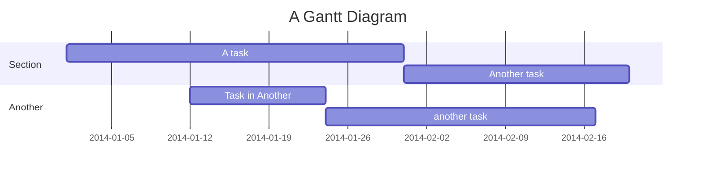

# awf-org

> AWebFactory Organization Project Flow & Tracker #BuildInPublic #LearnInPublic open projects platform based on Astro SSR
>
> As `Project Flow and Tracker` the site will soon be self-documenting.
> Meanwhile, see below [The Making of](#awebfactoryorg-project-flow--tracker-the-making-of)

- [ ] Site now self-documenting

- commit

```bash
# site not yet self-documenting

```

## AWebFactory.org (Project Flow & Tracker). The Making of



- [Repo](https://github.com/awebfactory/awf-org)
- Staging site
- Production site

### Scaffolding the site

- Created 2024-02-09 using my own [Mini Astro 4 Starter](https://github.com/victorkane/mini-astro-4-starter) 2024-02-09
- see initial commits

## Ref (Best Practices)

> Wherever possible I have tried to follow Web Dev Engineering best practices, as exemplified by the following resources (any errors or ommisions my own):

- [Astro Docs](https://docs.astro.build/en/getting-started/)
  - [Astro Docs. SSR Adapters](https://docs.astro.build/en/guides/server-side-rendering/)
  - [Astro Docs. Dynamic Routes (SSG and SSR modes)](https://docs.astro.build/en/guides/routing/)
- [Brad Traversy (Traversy Media) astro-blog ssr example](https://github.com/bradtraversy/astro-blog)
- [Chris Pennington (Coding in Public) YT 2023-08-23 Choosing between SSR, SSG, and dynamic rendering in Astro](video https://youtu.be/aIHRjloFASU?si=_QdqdoTqUnn5dQi8)
- [Kevin Zuniga Cuellar kevinzunigacuellar / astro-supabase example](https://github.com/kevinzunigacuellar/astro-supabase)

```

```
